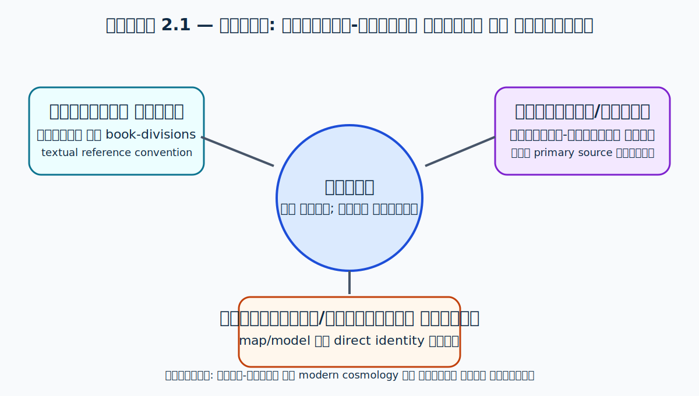
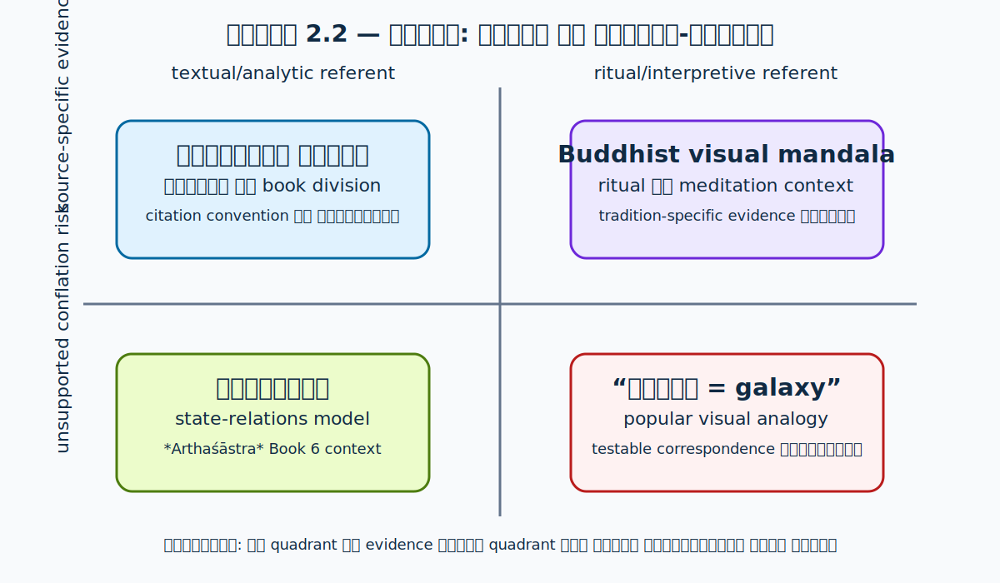

# 02. मण्डल क्या है — What is Mandala

> **स्थिति:** कार्याधीन · **Citation status:** प्राथमिक और द्वितीयक स्रोत-समीक्षा आरम्भ

## अध्याय उद्देश्य

1. *मण्डल* शब्द के पाठ-संगठन, धार्मिक-दार्शनिक और चित्रात्मक अर्थों को अलग-अलग पहचानना।
2. वैदिक “मण्डल” (ऋग्वेद की पुस्तक-विभाजन प्रणाली) और बाद के ritual/cosmographic uses को बिना anachronism के अलग रखना।
3. आधुनिक “model”, “map”, “diagram” और scientific evidence से तुलना की वैध सीमा निर्धारित करना।

## Scope analysis

- **सीमा:** यह chapter शब्द, textual organisation और later visual/ritual usages की research framework देगा; यह भू-मण्डल, मेरु अथवा किसी विशेष Tantric mandala की पूर्ण exegesis नहीं है।
- **पिछले chapter से सम्बन्ध:** Chapter 01 की चार-स्तरीय source separation यहाँ *मण्डल* शब्द पर लागू होती है।
- **आगे के chapters से सम्बन्ध:** भू-मण्डल, सप्त-द्वीप, मेरु और ज्योतिर्मण्डल chapters इस शब्द-नीति को उनके अपने primary texts के साथ विशेषीकृत करेंगे।
- **सम्भावित भ्रान्ति:** वृत्ताकार diagram, “universe” शब्द और modern galaxy image का visual resemblance empirical identity सिद्ध नहीं करता।

## प्राथमिक संस्कृत स्रोत

| स्रोत | संस्करण/पाठ | अध्याय/श्लोक | उपयोग की सीमा |
| --- | --- | --- | --- |
| ऋग्वेद संहिता, शाकल परम्परा | Vedic Heritage Portal का पाठ-संगठन पृष्ठ | मण्डल 1–10; उदाहरण RV 3.16.7 | “मण्डल” को book-division के रूप में स्थापित करना; cosmographic अर्थ सिद्ध नहीं करता।[^vh-rigveda] |

## द्वितीयक अकादमिक स्रोत

| लेखक/संस्था | प्रकाशन | प्रकार | उपयोग की सीमा |
| --- | --- | --- | --- |
| Vedic Heritage Portal / IGNCA | “Rigveda Samhita” परिचय | institutional reference | ऋग्वेद की contemporary presentation और division data; historical dating का अकेला आधार नहीं।[^vh-rigveda] |
| Encyclopedia of Buddhism | “Mandala” | scholarly reference entry | Buddhist use में “circle”, centre/periphery और ritual diagram के meanings का secondary orientation; Hindu/Puranic usage का substitute नहीं।[^eob-mandala] |

## परम्परागत, ऐतिहासिक और translation risks

- **पारम्परिक व्याख्या:** Buddhist, Hindu, Jain, Tantric और modern devotional uses को एक अखण्ड “traditional meaning” कहना अस्वीकार्य है; प्रत्येक usage को named text और tradition के साथ पढ़ना होगा।
- **ऐतिहासिक/पाठालोचनात्मक जोखिम:** ऋग्वेद की book-division और later visual mandala को केवल spelling के आधार पर एक continuous technical system नहीं माना जा सकता।
- **अनुवाद जोखिम:** “circle”, “disc”, “assembly”, “sphere”, “diagram” और “cosmos” अलग English glosses हैं; एक gloss को बिना context Sanskrit meaning नहीं कहा जाएगा।
- **इकाई/पैमाना जोखिम:** visual mandala को measurement map या astronomical scale drawing के रूप में पढ़ने का आधार dossier में उपलब्ध नहीं है।

## विवादित दावे और परीक्षण-सीमा

| दावा | दावा करने वाला स्रोत | सत्यापन की आवश्यकता | वर्तमान स्थिति |
| --- | --- | --- | --- |
| “मण्डल” हर संस्कृत context में universe का technical map है | लोकप्रिय सामान्यीकरण; एक primary source पर्याप्त नहीं | genre-wise primary texts, philology और commentary | Evidence is currently inconclusive |
| किसी mandala diagram का आधुनिक galaxy से direct correspondence है | आधुनिक comparative claim | defined referents, scale, prediction और independent evidence | Evidence is currently inconclusive |

## अनुत्तरित प्रश्न

- किन early Sanskrit corpora में *maṇḍala* का कौन-सा अर्थ attested है, और किस edition/lexicon से वह verify होगा?
- ritual, Buddhist, Tantric और Puranic uses को एक ही genealogy में रखने के लिए कितना historical evidence उपलब्ध है?
- किस स्थिति में diagrammatic similarity केवल visual analogy है, empirical claim नहीं?

## परिचय

*मण्डल* (IAST: *maṇḍala*) इस पुस्तक का शीर्षक-शब्द है, पर इसे एक ही आकर्षक अर्थ में बाँधना सबसे बड़ा जोखिम है। आधुनिक हिन्दी में यह कभी आकृति, कभी धार्मिक diagram और कभी “ब्रह्माण्ड का प्रतीक” कहलाता है; संस्कृत पाठों में इसके उपयोग अधिक विविध हैं। इस अध्याय का लक्ष्य किसी dictionary gloss को अंतिम अर्थ बनाना नहीं, बल्कि यह दिखाना है कि referent पाठ, genre, काल और practice के साथ बदलता है। यह [अध्याय 01](01-introduction.md) की source-separation पद्धति का शब्द-स्तरीय प्रयोग है।

Lexical range और किसी passage का actual meaning अलग प्रश्न हैं। “वृत्त” या “चक्र” जैसा gloss उपयोगी शुरुआत हो सकता है, किन्तु उससे यह निष्कर्ष नहीं निकलता कि हर *मण्डल* गोल है, हर गोल आकृति ritual mandala है, या हर ritual mandala modern astronomical map है।

## इतिहास

ऋग्वेद की received Śākala Saṃhitā को Vedic Heritage Portal दस *मण्डल*ों में व्यवस्थित compilation के रूप में प्रस्तुत करता है और RV 3.16.7 जैसे citation को “third maṇḍala, sixteenth sūkta, seventh mantra” की reference convention से समझाता है.[^vh-rigveda] इस सीमित, सत्यापनीय अर्थ में *मण्डल* textual/book division है। यह evidence किसी visual diagram, inner cosmos या physical universe के लिए नहीं है।

बाद के Indian religious traditions में mandala का ritual और visual usage प्रभावशाली है, पर उसका historical relation ऋग्वैदिक book-label से केवल समान spelling के कारण सिद्ध नहीं होता। Buddhist reference literature इसे centre/periphery और ritual diagram/साधना के कई usages में रखती है.[^eob-mandala] Metropolitan Museum की scholarly publication Tibetan Buddhist mandala को religious practice के लिए “diagram of the universe” कहती है; यह उस visual-religious tradition का description है, न कि ऋग्वेद के सभी मण्डलों की definition.[^met-mandala]

राजनीतिक literature में *rāja-maṇḍala* तीसरा अलग domain है। INFLIBNET के academic material के अनुसार *Arthaśāstra* के sixth *adhikaraṇa* में Maṇḍala Theory आती है; Oxford edition में Book Six का शीर्षक “Basis of the Circle” है.[^inflibnet-artha][^olivelle-artha] यहाँ circle states और relations की analytic arrangement है, sacred diagram या galaxy नहीं।

## संस्कृत स्रोत

<!-- ग्रन्थ, संस्करण, अध्याय/श्लोक और प्रकाशन विवरण। -->

## मूल संस्कृत

इस chapter के लिए exact Sanskrit passage और critical-edition verification अभी पर्याप्त नहीं है; इसलिए कोई verse यहाँ visual authority के लिए उद्धृत नहीं किया गया है। **साक्ष्य अभी अनिर्णायक हैं।**

## हिन्दी अनुवाद

<!-- अनुवादक, edition और citation दें। -->

## शब्दार्थ

| शब्द | व्याकरण/अर्थ | स्रोत |
| --- | --- | --- |
| *maṇḍala* | context-dependent noun; single equivalent नहीं | अलग स्रोतों में अलग usage[^vh-rigveda][^eob-mandala] |
| ऋग्वैदिक मण्डल | संहिता का textual/book division | Vedic Heritage Portal[^vh-rigveda] |
| राजमण्डल | states/relations का political circle-model | *Arthaśāstra* Book 6 context[^inflibnet-artha][^olivelle-artha] |

## व्याख्या

### पुराणिक कथन

इस chapter में कोई पुराणिक passage उद्धृत नहीं किया गया है। इसका कारण यह नहीं कि पुराणिक cosmography में *भू-मण्डल* या संबंधित compounds अप्रासंगिक हैं; कारण यह है कि compound के किसी घटक का lexical अर्थ पूरे compound के referent को निर्धारित नहीं करता। किसी पुराण के context, commentary और textual location के बिना “मण्डल = physical universe” कहना इस अध्याय की स्रोत-नीति के विरुद्ध होगा। उन claims का primary-text examination chapters 08 और 11 में होना चाहिए।

### पारम्परिक व्याख्या

Buddhist usages में mandala का केन्द्र, परिधि, deity-retinue और ritual practice से सम्बन्ध हो सकता है; यह केवल flat geometry नहीं है.[^eob-mandala] Met publication जिस “diagram of the universe” की बात करती है, वह Tibetan Buddhist religious practice में true reality को map करने की devotional-ritual vocabulary है.[^met-mandala] उसे “modern universe का observational chart” पढ़ना category error होगा। उसी तरह, किसी later Hindu/Tantric visual usage को ऋग्वेद के book-divisions पर वापस आरोपित करना historical inference नहीं, एक अतिरिक्त hypothesis है जिसे independent evidence चाहिए।

यह distinction पारम्परिक अर्थ को कम नहीं करता। Ritual diagram का कार्य साधक की attention, invocation, orientation अथवा sacred space को organise करना हो सकता है। पर उस कार्य को तभी समझा जा सकता है जब उसे उसके practice और commentary के साथ पढ़ा जाए, न कि केवल modern scientific vocabulary में अनुवादित करके।

### ऐतिहासिक विद्वत्ता

Historical scholarship का पहला योगदान chronology को सरल कथा बनने से रोकना है। *Arthaśāstra* के date, compositional history और authorship पर प्रश्न बने हुए हैं; Olivelle का introduction इन्हें अलग scholarly problems के रूप में रखता है.[^olivelle-artha] अतः राजमण्डल को “Chanakya ने fourth century BCE में खोजा हुआ eternal geopolitical law” लिखना स्रोत से अधिक दावा होगा। इसके बजाय सुरक्षित निष्कर्ष यह है कि उपलब्ध *Arthaśāstra* tradition में Book 6 state relations के circle-model को व्यवस्थित करती है.[^inflibnet-artha][^olivelle-artha]

दूसरा योगदान semantic development को visible बनाना है। एक शब्द का long afterlife होना continuity of spelling दिखाता है, continuity of one technical meaning नहीं। ऋग्वैदिक citation-label, statecraft model, visual/ritual configuration और later popular art—इनमें overlap या historical connection कहीं-कहीं हो सकता है; पर प्रत्येक connection को sources से दिखाना होगा। इस chapter की वर्तमान evidence-base उन connections का exhaustive genealogy स्थापित नहीं करती। **साक्ष्य अभी अनिर्णायक हैं।**

### आधुनिक वैज्ञानिक दृष्टि

Modern science में visualisation को evidential status केवल उसके data, method, scale और uncertainty से मिलता है। उदाहरण के लिए astronomical image किसी wavelength, telescope, processing method और coordinate convention से जुड़ी होती है; उसका circular composition उसे mandala नहीं बनाता। उलटे, sacred visual में symmetry या centre का होना उसे observational measurement नहीं बनाता। यह chapter modern astronomy का survey नहीं देता; उसका निष्कर्ष केवल इतना है कि visual resemblance को empirical equivalence नहीं माना जा सकता।

## वैज्ञानिक विश्लेषण

किसी “mandala–galaxy correspondence” को scientific claim मानने के लिए source text को unique, pre-specified physical features बताने चाहिए—जैसे defined object, scale, relation या testable prediction। फिर उन्हें independent observations से compare किया जा सकता है। वर्तमान dossier में न तो ऋग्वैदिक book-division, न political circle-of-states, और न Buddhist ritual diagram ऐसा pre-specified astronomical model उपलब्ध कराते हैं. इसलिए “मण्डल आधुनिक galaxy का पूर्वानुमान है” conclusion का evidential status **अनिर्णायक/अपर्याप्त साक्ष्य** है, न कि established science।

### Cosmological और astronomical label की सीमा

“cosmological” शब्द दो अलग स्तरों पर उपयोग हो सकता है। किसी religious visual में whole world, sacred realm या ordered totality का representation होना cosmological symbolism है। लेकिन यह physical cosmology का observational model तभी होगा जब text और interpretive tradition object, scale, motion या measurement को उस तरह निर्धारित करें कि वे independent testing के लिए उपलब्ध हों। Met publication का Tibetan Buddhist mandala-वर्णन पहले प्रकार—religious diagram of the universe—का evidence देता है.[^met-mandala] वह दूसरे प्रकार, अर्थात modern astronomy के data model, का evidence नहीं देता।

इसी तरह “astronomical mandala” जैसे general labels को source-location के बिना इस्तेमाल नहीं किया जाएगा। Sanskrit astronomical literature में कोई compound या technical use होने का संभावित दावा, उसके text, recension, computational context और translation की जाँच के बिना इस chapter में स्थापित नहीं किया गया है। *ज्योतिर्मण्डल* और celestial ordering पर substantive textual work Chapter 11 का विषय है। इसलिए इस chapter में astronomical usage के लिए सही classification **G — अनिर्णायक / अपर्याप्त साक्ष्य** है, न कि मौन रूप से लिया गया fact।

### राजमण्डल: रूपक नहीं, political model

राजमण्डल को केवल “राजाओं का decorative circle” कहना भी उतना ही भ्रामक है जितना इसे galaxy map कहना। Course material और Oxford table of contents उसे *Arthaśāstra* के statecraft and interstate-relations discussion में रखते हैं.[^inflibnet-artha][^olivelle-artha] यहाँ spatial language relations को organise करती है: यह political analysis का domain है। उसका circle-form किसी sacred visual से तुलना के लिए रोचक analogy बन सकता है, पर analogy से shared origin या shared metaphysical claim सिद्ध नहीं होता।

यह difference भारतीय intellectual history को छोटे खानों में बाँटने के लिए नहीं, बल्कि उसके genres को गंभीरता से लेने के लिए है। एक ही Sanskrit lexeme literary compilation, polity, ritual practice और visual culture में productive हो सकता है। उस बहुलता को स्वीकारना “meaninglessness” नहीं है; यह उस evidence का सम्मान है जो हर use के लिए अलग है।

### दार्शनिक, तान्त्रिक और लोकप्रिय विस्तार

बाद की धार्मिक-दार्शनिक परम्पराओं में *मण्डल* का meaning केवल lexical object तक सीमित नहीं रह सकता। Buddhist secondary reference इसे central principle, surrounding retinue, visual representation और practitioner-world relation तक फैलने वाली vocabulary में रखती है.[^eob-mandala] इस प्रकार का usage philosophical या soteriological function रख सकता है: वह “दुनिया किस आकार की है?” का empirical answer देने के बजाय साधना में world, body, deity और awareness के सम्बन्धों को व्यवस्थित कर सकता है। इस function को स्वीकारना उसे physics नहीं बनाता, और physics न होना उसे religious practice में निरर्थक नहीं बनाता।

“Tantric mandala” भी एक blanket label नहीं है। कौन-सा text, कौन-सी lineage, कौन-सा deity system, किस initiation या ritual procedure में diagram प्रयुक्त है—ये questions answer किए बिना केवल concentric geometry को “tantric” कहना inadequate है। Met की Tibetan Buddhist study India–Tibet transmission और distinct Tibetan visual approach की बात करती है; इससे broad cultural connection का context मिलता है, पर हर Indian visual diagram की lineage या date सिद्ध नहीं होती.[^met-mandala] इस chapter में इसलिए tantric tradition पर exhaustive conclusion नहीं दिया गया है।

आधुनिक popular usage में *mandala* कभी adult colouring pattern, therapeutic motif या generic “wholeness” symbol बन जाता है। यह semantic afterlife अध्ययन के लिए रोचक हो सकता है, पर इसे ancient Sanskrit source का direct meaning नहीं कहना चाहिए। वही discipline यहाँ लागू होता है जो राजमण्डल और galaxy analogy पर लागू हुआ: later reception को later reception के रूप में cite करें; उसे primary-text evidence में न बदलें।

## दावों का वर्गीकरण

| कथन | वर्ग | इस chapter का निष्कर्ष |
| --- | --- | --- |
| ऋग्वेद में मण्डल citation/book division है | A — शास्त्रीय वर्णन | Portal का reference convention इसे support करता है.[^vh-rigveda] |
| Buddhist mandala ritual/visual sacred realm हो सकता है | B — पारम्परिक व्याख्या | Buddhist secondary orientation; अन्य traditions के लिए universal rule नहीं.[^eob-mandala] |
| राजमण्डल state relations का analytic model है | D — ऐतिहासिक/पाठालोचनात्मक निष्कर्ष | *Arthaśāstra* Book 6 context; dating/authorship questions खुले हैं.[^inflibnet-artha][^olivelle-artha] |
| Mandala ancient galaxy map है | G — अनिर्णायक / अपर्याप्त साक्ष्य | defined, testable correspondence उपलब्ध नहीं। |

## तुलना तालिका

| विषय | पुराणिक कथन | पारम्परिक व्याख्या | आधुनिक वैज्ञानिक दृष्टि | प्रमाण/स्रोत |
| --- | --- | --- | --- | --- |
| ऋग्वैदिक मण्डल | इस chapter में cosmographic assertion नहीं | लागू नहीं | scientific object नहीं | textual organisation[^vh-rigveda] |
| Buddhist visual mandala | कोई Puranic claim नहीं | ritual/meditative sacred realm | observational astronomy नहीं | scholarly orientation[^eob-mandala][^met-mandala] |
| राजमण्डल | Puranic cosmology नहीं | political-statecraft model | astronomy से direct comparison नहीं | Book 6 context[^inflibnet-artha][^olivelle-artha] |
| galaxy–mandala equivalence | verified scriptural basis प्रस्तुत नहीं | modern popular reinterpretation हो सकती है | testable correspondence अनुपस्थित | साक्ष्य अभी अनिर्णायक हैं |

## महत्वपूर्ण टिप्पणियाँ

!!! warning "पद्धति"
    आस्था, रूपक और अनुभवजन्य वैज्ञानिक दावे अलग रखें। अपर्याप्त प्रमाण को **Evidence Inconclusive** लिखें।

### Semantic conflation की जाँच

चार shortcuts इस विषय को भ्रमित करते हैं। पहला, “circle” gloss से यह निष्कर्ष कि सभी *maṇḍala* geometric drawings हैं। दूसरा, cosmic symbolism से यह निष्कर्ष कि diagram observed physical cosmos की scale-map है। तीसरा, *rāja-maṇḍala* के “circle” को devotional mandala के deity-centred structure के समान मानना। चौथा, किसी later visual practice को ancient Vedic passage का direct exposition कहना। उपलब्ध sources इन shortcuts के बजाय अलग textual, ritual और political contexts दर्शाते हैं.[^vh-rigveda][^eob-mandala][^inflibnet-artha]

इस chapter का comparative outcome इसलिए negative नहीं बल्कि disciplined है। *मण्डल* एक productive comparative term हो सकता है, जब comparison का प्रकार स्पष्ट हो: textual organisation की तुलना corpus architecture से, political circle-model की relation-model से, और ritual diagram की religious visualisation से। किन्तु analogy को historical descent, physical identity या scientific prediction कहना अलग और अधिक मजबूत evidence माँगता है।

## आरेख

**चित्र 2.1 — मण्डल: सन्दर्भ-निर्भर अर्थों का मानचित्र.** श्रेणी: स्रोत-सम्बन्ध का मूल concept map। स्रोत: Original diagram; attribution register देखें। पैमाना: लागू नहीं।

**चित्र 2.2 — मण्डल: उपयोग और प्रमाण-सीमाएँ.** विवरण: एक usage का evidence दूसरे usage या modern scientific claim में स्वतः स्थानांतरित नहीं होता। श्रेणी: स्रोत-सम्बन्ध का मूल matrix। स्रोत: Original diagram; attribution register देखें। पैमाना: लागू नहीं।

## सन्दर्भ

<!-- [^key]: Author. *Title*. Edition/year. DOI, archive ID, या स्थिर URL. -->

## सारांश

*मण्डल* को इस chapter में एक single scientific या theological code नहीं माना गया। ऋग्वेद में verified usage textual organisation है; Buddhist material ritual-visual and devotional use की दिशा देता है; *Arthaśāstra* political relations के circle-model की ओर ले जाती है। इन domains को अलग रखना tradition को घटाना नहीं, बल्कि हर source को उसके अपने evidence और function के साथ पढ़ना है।

## प्रश्न

1. किस अतिरिक्त primary text और philological evidence के बाद ऋग्वैदिक और later ritual uses के historical relation पर मजबूत दावा किया जा सकेगा?
2. किसी sacred diagram और scientific visualisation के बीच comparison को testable बनाने के लिए कौन-से conditions आवश्यक हैं?

## Key Takeaways

- *मण्डल* के textual, political, ritual-visual और popular uses अलग evidential categories हैं।
- ऋग्वेद की organisational “मण्डल” division स्वयं में modern cosmographic map का प्रमाण नहीं है.[^vh-rigveda]
- Religious cosmological symbolism और observational cosmology के claims को उनके अलग methods तथा evidence के साथ पढ़ना चाहिए.

## Research Gaps

- एक peer-reviewed philological study और verified Sanskrit lexicon/critical edition citation जोड़ना शेष है।
- Puranic, Buddhist और Tantric contexts का historical relationship यहाँ अभी स्थापित नहीं किया गया है।
- Sanskrit astronomical texts में *maṇḍala* compounds के exact occurrences और technical meaning को source-by-source verify करना शेष है; जब तक वह नहीं होता, astronomical equivalence का दावा नहीं किया जाएगा।

## Frequently Asked Questions

### क्या “मण्डल” का अर्थ हर जगह ब्रह्माण्ड है?

नहीं। उपलब्ध institutional reference ऋग्वेद में *मण्डल* को book-division के रूप में दिखाता है; अन्य contexts के लिए अलग textual evidence आवश्यक है.[^vh-rigveda]

### क्या कोई mandala diagram आधुनिक galaxy का वैज्ञानिक मानचित्र है?

ऐसे direct correspondence के लिए defined scale, referent और independently testable prediction चाहिए। वर्तमान dossier में ऐसा evidence उपलब्ध नहीं है: **Evidence is currently inconclusive.**

## References

[^vh-rigveda]: Indira Gandhi National Centre for the Arts, Vedic Heritage Portal, “[ऋग्वेद संहिता / Rigveda Samhita](https://vedicheritage.gov.in/hi/samhitas/rigveda/).” Accessed 16 July 2026. The portal states the ten-maṇḍala division and gives RV 3.16.7 as an example of its reference convention.

[^eob-mandala]: Encyclopedia of Buddhism, “[Mandala](https://encyclopediaofbuddhism.org/wiki/Mandala).” Accessed 16 July 2026. Secondary orientation for Buddhist terminology; it is not used here as evidence for Vedic or Puranic textual meaning.

[^met-mandala]: Kurt Behrendt, Christian Luczanits, and Amy Heller, *Mandalas: Mapping the Buddhist Art of Tibet* (Metropolitan Museum of Art, 2024), publication description, https://www.metmuseum.org/met-publications/mandalas-mapping-the-buddhist-art-of-tibet. Accessed 16 July 2026.

[^inflibnet-artha]: INFLIBNET Centre, “[Arthaśāstra](https://ebooks.inflibnet.ac.in/icp05/chapter/arthasastra/).” Accessed 16 July 2026. The course material identifies the sixth *adhikaraṇa* as the place where Maṇḍala Theory is taken up.

[^olivelle-artha]: Patrick Olivelle, *King, Governance, and Law in Ancient India: Kautilya’s Arthaśāstra* (Oxford University Press, 2013), table of contents and introduction, https://doi.org/10.1093/acprof:osobl/9780199891825.001.0001. Accessed 16 July 2026.

## Further Reading

- Kurt Behrendt, Christian Luczanits, and Amy Heller, *Mandalas: Mapping the Buddhist Art of Tibet* (Metropolitan Museum of Art, 2024).[^met-mandala]
- Patrick Olivelle, *King, Governance, and Law in Ancient India: Kautilya’s Arthaśāstra* (Oxford University Press, 2013).[^olivelle-artha]
- A critical edition and peer-reviewed philological study of *maṇḍala* usages will be added only after source verification.

## Next Chapter Preview

अगला chapter वैदिक corpus में universe-विषयक passages की genre, source-location और interpretive limits की जाँच करेगा; वह इस chapter की शब्द-नीति को cosmology claim नहीं मानेगा।
