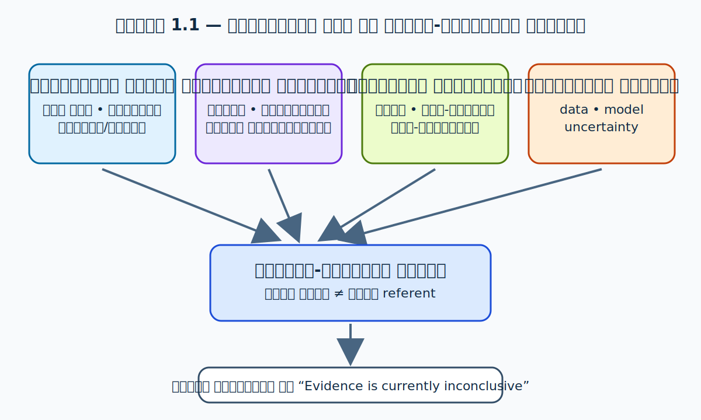
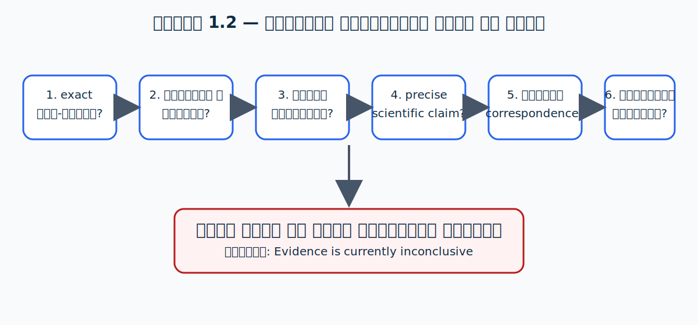

# 01. परिचय — Introduction

> **लेखकीय स्थिति:** पूर्ण · **पद्धति:** तुलनात्मक, स्रोत-आधारित और गैर-समानीकरणवादी

## परिचय

यह अध्याय पुस्तक की शोध-सीमा, स्रोत-नीति और तुलनात्मक विधि स्थापित करता है। इसका कोई निष्कर्ष किसी शास्त्रीय परम्परा को आधुनिक विज्ञान में घटाता या modern model को धार्मिक मत में बदलता नहीं है।

## इतिहास

“पुराणिक cosmology” और “modern cosmology” की ऐतिहासिक development अलग प्रकार की है। बाद के chapters में प्रत्येक पाठ और वैज्ञानिक model की तारीख, transmission तथा evidence-base को अलग से दर्ज किया जाएगा; इस परिचय में कोई व्यापक historical priority claim नहीं किया गया है।

## 1.1 विषय, उद्देश्य और सीमा

“मण्डल विज्ञान” नामक यह पुस्तक उन प्रश्नों के अध्ययन के लिए बनाई गई है जिन्हें संस्कृत वैदिक, उपनिषदिक और पुराणिक साहित्य एक ओर तथा आधुनिक खगोल-विज्ञान और ब्रह्माण्ड-विज्ञान दूसरी ओर उठाते हैं: जगत् की रचना या उद्भव का विचार क्या है; उसके स्तर, दिशा, काल और जीव-जगत् का वर्णन किस भाषा में होता है; और आधुनिक विज्ञान ब्रह्माण्ड की उत्पत्ति, विस्तार, संरचना तथा प्रेक्षणीय सीमा को किन विधियों से समझता है? इस पुस्तक का लक्ष्य इन परम्पराओं के बीच एक पूर्वनिर्धारित “मेल” सिद्ध करना नहीं है। इसका लक्ष्य पाठ, भाष्य, इतिहास और प्रेक्षणीय प्रमाण—इन चारों को उनके अपने नियमों के भीतर समझना और फिर सावधानी से तुलना करना है।

यह सीमा विशेष रूप से आवश्यक है। संस्कृत शब्द *ब्रह्माण्ड*, *लोक*, *भू-मण्डल*, *द्वीप*, *मेरु*, *काल्प*, *युग* या *ग्रह* अलग-अलग साहित्यिक, दार्शनिक, अनुष्ठानिक और खगोलीय प्रसंगों में आते हैं। केवल आधुनिक शब्दों—जैसे “galaxy”, “planet”, “universe” या “dimension”—के निकट सुनाई देने के कारण उन्हें उनका अनुवाद मान लेना विधिसम्मत नहीं है। उसी प्रकार आधुनिक cosmology का “Big Bang” कोई दृश्य विस्फोट-कथा नहीं, बल्कि गर्म और घने आरम्भिक अवस्था से विस्तार करते ब्रह्माण्ड का गणितीय-प्रेक्षणीय मॉडल है; NASA भी इसे वर्तमान वैज्ञानिक सिद्धान्तों का इतिहास बताता है और जिन बातों पर वैज्ञानिक अनिश्चित हैं उन्हें स्पष्ट रूप से अनिश्चित कहता है।[^nasa-universe]

पुस्तक के पाठक शोधार्थी, विद्यार्थी, इस्कॉन के पाठक, वैदिक परम्परा के अध्येता, astronomy के विद्यार्थी और भारतीय ज्ञान-परम्परा के शोधकर्ता हैं। अतः यहाँ दो प्रकार की असावधानी से बचना अनिवार्य है। पहली असावधानी है धार्मिक पाठ को बिना उसके भाषिक और भाष्य-संदर्भ के आधुनिक विज्ञान की भविष्यवाणी कहना। दूसरी असावधानी है धार्मिक या दार्शनिक पाठ को केवल इसलिए निरर्थक घोषित कर देना कि उसका उद्देश्य आधुनिक प्रयोगशाला-विज्ञान जैसा नहीं है। दोनों ही स्थितियों में पाठ और विज्ञान, दोनों के साथ अन्याय होता है।

इस अध्याय में किसी श्लोक का उद्धरण नहीं दिया गया है। इसका कारण यह नहीं कि वैदिक अथवा पुराणिक स्रोत अप्रासंगिक हैं, बल्कि यह है कि श्लोक को मूल पाठ, पाठ-भेद, transliteration, अनुवाद, पद-अर्थ, प्रसंग और स्रोत-संस्करण सहित पढ़ना चाहिए। वह कार्य क्रमशः नासदीय सूक्त, हिरण्यगर्भ, ब्रह्माण्ड, भू-मण्डल, ज्योतिर्मण्डल और समय-विषयक अध्यायों में किया जाएगा। परिचय का काम पाठों पर निष्कर्ष थोपना नहीं, बल्कि उन्हें पढ़ने की पद्धति और प्रश्नों की सीमा स्पष्ट करना है।

## 1.2 “ब्रह्माण्ड-विज्ञान” के दो भिन्न अर्थ

आधुनिक विज्ञान में cosmology सामान्यतः ब्रह्माण्ड की उत्पत्ति, संरचना और विकास का अध्ययन है। NASA Jet Propulsion Laboratory भी इसे इसी अर्थ में परिभाषित करता है और उसके प्रमुख प्रश्नों को observations, physical theory तथा quantitative models से जोड़ता है।[^nasa-jpl] इस अर्थ में किसी प्रस्ताव की शक्ति इस बात से परखी जाती है कि वह किन प्रेक्षणों को समझाता है, कौन-सी मापनीय भविष्यवाणियाँ देता है, किन परिस्थितियों में गलत सिद्ध हो सकता है, और क्या स्वतंत्र दल उसे पुनः जाँच सकते हैं। CMB, galaxy redshift, primordial element abundances, gravitational lensing और supernova measurements ऐसे भिन्न प्रकार के data हैं जिनसे वर्तमान cosmological models की जाँच की जाती है।[^nasa-cobe][^nasa-big-bang]

भारतीय संस्कृत साहित्य में “ब्रह्माण्ड-विज्ञान” कहना सुविधा के लिए उपयोगी है, पर वह एक ही आधुनिक discipline का प्राचीन नाम नहीं है। वैदिक संहिताओं में सृष्टि, ऋत, देवता, प्रकाश, जल, द्यौः और पृथ्वी पर काव्यात्मक-अनुष्ठानिक कथन मिलते हैं। उपनिषदों में जगत्, आत्मन्, ब्रह्मन् और ज्ञान के प्रश्नों पर दार्शनिक विवेचन है। महाकाव्य और पुराण विभिन्न लोकों, काल-चक्रों, वंशावलियों, भूगोल, तीर्थ और धर्म के व्यापक आख्यान रचते हैं। ज्योतिष तथा गणितीय खगोल-ग्रन्थ, जैसे *सूर्यसिद्धान्त* और *आर्यभटीय*, गणना, काल-निर्णय, ग्रह-स्थितियों और astronomical modelling से सम्बन्धित अलग प्रकार का साहित्य हैं। इन सभी को एक ही कथन-वर्ग मानना अनुचित होगा।

अतः इस पुस्तक में “पुराणिक cosmology” एक सुविधाजनक छत्र-शब्द है, कोई दावा नहीं कि सभी भारतीय स्रोत एक ही काल, लेखक, भाषा या प्रयोजन से निकले हैं। हर अध्याय यह बताएगा कि वह किस corpus की बात कर रहा है। उदाहरणार्थ, किसी पुराण में दिया लोक-वर्णन ऋग्वैदिक मन्त्र का प्रत्यक्ष अर्थ नहीं बन जाता; किसी सिद्धान्त-ग्रन्थ में प्रयुक्त गणितीय parameter को पुराणिक आख्यान के scale से स्वतः नहीं मिलाया जा सकता; और किसी आधुनिक astronomical term का संस्कृत पर्याय चुन लेने से दोनों concept समान प्रमाणित नहीं हो जाते।

## 1.3 प्रश्नों की वैधता और उत्तरों की भिन्नता

मनुष्य ने आकाश, ऋतुओं, दिन-रात, सूर्य, चन्द्र और तारों को देखकर बहुत पुराने समय से प्रश्न किए हैं। “जगत् क्यों है?”, “पहले क्या था?”, “काल का आरम्भ है या चक्र?”, “मनुष्य का स्थान क्या है?” जैसे प्रश्न केवल factual description नहीं हैं। इनमें metaphysical, ethical और existential आयाम भी होते हैं। आधुनिक cosmology इनमें से कुछ प्रश्नों को operational रूप में बदलती है: दूरस्थ वस्तु का redshift कितना है; CMB का spectrum क्या है; gravitational field का observable प्रभाव क्या है; कौन-सा parameter data के साथ कितनी संगति रखता है। यह परिवर्तन उसकी कमजोरी नहीं बल्कि उसकी विशिष्ट शक्ति है—वह ऐसे प्रश्न चुनती है जिन्हें measurement और model comparison से परखा जा सकता है।

इसके विपरीत धार्मिक-दर्शनिक ग्रन्थ अस्तित्व, अर्थ, चेतना, कर्म, मुक्ति, धर्म और परम-सत्ता जैसे प्रश्नों को भी साधते हैं। उनका सत्य-दावा अक्सर testimony, शास्त्रीय परम्परा, तर्क, साधना और भाष्य-परम्परा के भीतर रखा जाता है। इस भेद का अर्थ यह नहीं कि एक “सत्य” और दूसरा “असत्य” है; इसका अर्थ है कि दोनों के validation criteria, genre और उद्देश्य अलग हो सकते हैं। जहाँ कोई दावा भौतिक माप, दूरी, काल या वस्तु की गति के बारे में हो, वहाँ उस दावे को आधुनिक measurement से तुलना के लिए प्रस्तुत किया जा सकता है। जहाँ कथन मुक्ति, परमात्मा या साधना के अनुभव की बात करता हो, वहाँ उसे उसी रूप में metaphysical या theological claim कहना अधिक ईमानदार है।

इस पुस्तक का मूल नियम इसलिए है: प्रश्नों को मिलाया जा सकता है, प्रमाण-मानदण्डों को चुपचाप नहीं मिलाया जा सकता। किसी पाठ में “आकाश” शब्द हो और telescope से एक astronomical object दिखे, तो दोनों पर बातचीत सम्भव है; पर समान शब्द-भाव से समान referent सिद्ध नहीं होता। इसी तरह किसी वैज्ञानिक model में “origin” पर चर्चा हो और किसी मन्त्र में “creation” का प्रश्न हो, तो दोनों को साथ पढ़ना मूल्यवान हो सकता है; पर एक दूसरे का translation या experimental proof नहीं हो जाते।

## संस्कृत स्रोत

यह methodological introduction किसी एक संस्कृत passage की exegesis नहीं करता। वैदिक, उपनिषदिक, पुराणिक और सिद्धान्त-साहित्य का source register संबंधित विषय-अध्यायों में edition और location सहित दिया जाएगा।

## मूल संस्कृत

इस अध्याय में कोई मूल श्लोक उद्धृत नहीं किया गया है; अतः यहाँ अप्रमाणित अथवा context-विहीन संस्कृत पाठ नहीं जोड़ा गया है।

## हिन्दी अनुवाद

कोई verse translation इस अध्याय का विषय नहीं है। अगले textual chapters में मूल और अनुवाद साथ-साथ प्रस्तुत होंगे।

## शब्दार्थ

| शब्द | इस अध्याय में कार्यशील अर्थ | सावधानी |
| --- | --- | --- |
| ब्रह्माण्ड-विज्ञान | विश्व की संरचना, उद्भव और काल के बारे में discourse | आधुनिक discipline और संस्कृत corpus को एक न मानें |
| शास्त्रीय कथन | निर्दिष्ट primary text में उपलब्ध कथन | भाष्य का निष्कर्ष नहीं |
| वैज्ञानिक प्रमाण | reproducible observations और उनकी model-based व्याख्या | metaphysical conclusion नहीं |

## व्याख्या

### पुराणिक कथन

यह अध्याय किसी पुराणिक cosmological proposition को independently स्थापित नहीं करता; वह आगामी पाठ-अध्ययनों के लिए citation और category की नीति निर्धारित करता है।

### पारम्परिक व्याख्या

जीवित सम्प्रदायों और भाष्यकारों के मतों को उनके अपने named sources के साथ प्रस्तुत किया जाएगा; उन्हें एक ही “हिन्दू मत” में नहीं मिलाया जाएगा।

### आधुनिक वैज्ञानिक दृष्टि

आधुनिक cosmology को observationally constrained models का क्षेत्र माना गया है, न कि ultimate metaphysical doctrine। NASA के public scientific summaries इस सीमित परिचय के institutional sources हैं.[^nasa-universe][^nasa-jpl]

## वैज्ञानिक विश्लेषण

इस पुस्तक का वैज्ञानिक analysis किसी धार्मिक कथन को विज्ञान से validate करने के लिए नहीं, बल्कि भौतिक और मापनीय दावों के evidence, units, uncertainty और observational consequences स्पष्ट करने के लिए होगा।

## तुलना तालिका

| विषय | शास्त्रीय कथन | पारम्परिक व्याख्या | आधुनिक वैज्ञानिक दृष्टि | प्रमाण/स्रोत |
| --- | --- | --- | --- | --- |
| सृष्टि/उद्भव | संबंधित textual chapters में edition सहित | भाष्य-परम्परा के अनुसार भिन्न | गर्म, घनी आरम्भिक अवस्था से विस्तार के models | NASA overview और mission sources[^nasa-universe][^nasa-cobe] |
| विश्व की सीमा | यहाँ कोई एक claim नहीं | सम्प्रदाय-विशिष्ट अध्ययन अपेक्षित | observable universe और whole universe भिन्न concepts | NASA overview[^nasa-universe] |
| आत्मा/चेतना | आगामी textual chapters | दार्शनिक/theological claims | empirical cosmology का प्रत्यक्ष विषय नहीं | प्रत्यक्ष तुलना का पर्याप्त आधार नहीं |

## 1.4 स्रोतों के तीन स्तर

हर substantive chapter में सामग्री को निम्न तीन स्पष्ट स्तरों में रखा जाएगा। यह केवल शैली का नियम नहीं; यही इस परियोजना का मुख्य epistemic safeguard है।

### (क) शास्त्रीय अथवा पुराणिक कथन

इस शीर्षक के नीचे केवल वही कहा जाएगा जो निर्दिष्ट पाठ, पाठ-संस्करण और स्थान में है। “शास्त्र कहता है” जैसे अनिश्चित वाक्य पर्याप्त नहीं होंगे। ग्रन्थ-नाम, खण्ड/स्कन्ध/अध्याय/श्लोक अथवा मन्त्र-संख्या, उपयोग किए गए edition और जहाँ उपलब्ध हो वहाँ critical edition या विश्वसनीय digital facsimile बताया जाएगा। यदि किसी पाठ के पाठ-भेद हैं, तो उन्हें छिपाया नहीं जाएगा। अनुवाद को मूल पाठ नहीं कहा जाएगा, और एक अनुवादक का विकल्प अन्य सम्भव अनुवादों के ऊपर अंतिम अधिकार नहीं माना जाएगा।

किसी श्लोक के लिए न्यूनतम record होगा: देवनागरी मूल, IAST transliteration, स्रोत-स्थान, अनुवादक सहित हिन्दी अनुवाद, महत्त्वपूर्ण पदों का व्याकरण-सचेत शब्दार्थ, उसके ठीक पहले और बाद का textual context, और व्याख्या से पृथक उसका सीमित literal sense। जब पाठ-प्राप्ति या edition विश्वसनीय ढंग से उपलब्ध न हो, उस पर आधारित निष्कर्ष स्थगित किया जाएगा। “Evidence Inconclusive” इस पुस्तक में असफलता का संकेत नहीं, ईमानदार शोध-स्थिति का नाम है।

### (ख) पारम्परिक अथवा दार्शनिक व्याख्या

“परम्परा का मत” एकवचन में नहीं लिखा जाएगा जब तक कि किसी विशेष सम्प्रदाय या भाष्यकार का मत स्पष्ट न हो। वैष्णव, अद्वैत, विशिष्टाद्वैत, द्वैत, सांख्य, योग अथवा अन्य परम्पराएँ किसी पद और आख्यान को अलग ढंग से पढ़ सकती हैं। इस्कॉन सम्बन्धी सामग्री के लिए ISKCON publication अथवा अधिकृत व्याख्या को उसी संस्था की व्याख्या के रूप में उद्धृत किया जाएगा; उसे सभी हिन्दू परम्पराओं का प्रतिनिधि नहीं बताया जाएगा। इसी प्रकार आधुनिक academic Indology में दिया historical interpretation परम्परागत theological interpretation का स्थानापन्न नहीं है।

व्याख्या को “मूल में यही अनिवार्य अर्थ है” तभी कहा जा सकेगा जब भाषिक और textual evidence उसे समर्थित करे। अन्यथा भाषा होगी: “फलाँ भाष्य में इसे इस प्रकार समझा गया है”, “फलाँ सम्प्रदाय इस वर्णन को literal मानता है”, या “फलाँ आधुनिक विद्वान इसे symbolic/ritual/structural रूप में पढ़ता है।” पाठक को यह जानने का अधिकार है कि वह primary text पढ़ रहा है, faith-based commentary, philological inference, या आधुनिक लेखक की hypothesis।

### (ग) आधुनिक वैज्ञानिक प्रमाण

विज्ञान वाले खंड में claim को publication, mission data, review article, university press text या recognised scientific institution के स्रोत से जोड़ा जाएगा। agency page उपयोगी आरम्भिक reference है, किन्तु जहाँ किसी विवादित या technical निष्कर्ष का प्रश्न होगा वहाँ peer-reviewed paper, mission archive या data release को प्राथमिकता दी जाएगी। वैज्ञानिक कथन भी समय के साथ बदलते हैं। उदाहरणतः NASA का current overview कहता है कि cosmologists के पास कई शक्तिशाली models और observations हैं, लेकिन inflation से पहले क्या था और dark energy क्या है—ये खुले प्रश्न हैं।[^nasa-universe][^nasa-building]

इस प्रकार “science has proved” जैसी भाषा असाधारण सावधानी से प्रयुक्त होगी। किसी observation का robust होना, उससे निकले model का best current explanation होना, और उसके ultimate metaphysical interpretation का सही होना—तीन अलग बातें हैं। वैज्ञानिक literature में uncertainty interval, systematic error, model assumptions और competing explanations होने पर उन्हें summary से हटाना गलत होगा। यह पुस्तक उस जटिलता को यथासम्भव बचाएगी, भले ही उत्तर कम आकर्षक या कम निर्णायक लगे।

## 1.5 आधुनिक ब्रह्माण्ड-विज्ञान: एक संक्षिप्त प्रमाण-मानचित्र

समकालीन cosmology का standard picture कई स्वतंत्र प्रकार के observational evidence के परस्पर संगत होने से बनता है। दूरस्थ galaxies के प्रकाश में redshift और distance संबंध बताते हैं कि large scale पर space का विस्तार हो रहा है। NASA के COBE वैज्ञानिक सारांश में Hubble के विस्तार-संबंधी प्रेक्षण और गर्म, घनी, फैलती आरम्भिक अवस्था के model के ऐतिहासिक development का वर्णन है।[^nasa-cobe] इसका अर्थ यह नहीं कि कोई observer ब्रह्माण्ड के आरम्भ को देख चुका है; इसका अर्थ है कि उपलब्ध data को general relativity और particle physics के साथ रखकर models बनते और परखे जाते हैं।

Cosmic microwave background (CMB) उस प्रमाण-मानचित्र का महत्वपूर्ण भाग है। NASA के अनुसार यह वह पुराना प्रकाश है जो तब मुक्त हुआ जब आरम्भिक ब्रह्माण्ड पर्याप्त ठंडा होकर पारदर्शी बना; आज वह expansion के कारण microwave wavelengths में देखा जाता है।[^nasa-big-bang] CMB का तापमान-पैटर्न, galaxies की large-scale distribution, light-element abundances और lensing जैसे data परस्पर constraints देते हैं। किसी एक लोकप्रिय infographic से “पूरा सिद्ध” होने का निष्कर्ष निकालना इसलिए अनुचित होगा; scientific confidence अनेक मापों, calibrations, uncertainty analyses और लगातार संशोधन से बनती है।

Dark matter और dark energy के बारे में भी भाषा संयत होनी चाहिए। “dark” का अर्थ आवश्यकतः रहस्यमय आध्यात्मिक पदार्थ नहीं है; यह मुख्यतः इस तथ्य की ओर संकेत करता है कि उसकी प्रकृति प्रत्यक्ष प्रकाशीय interaction से ज्ञात नहीं है। NASA का वर्तमान overview visible/ordinary matter, dark matter और dark energy के अनुपातों के model-dependent estimates देता है तथा स्वीकार करता है कि dark matter किस चीज़ से बना है और dark energy का भौतिक कारण क्या है, यह अभी अज्ञात है।[^nasa-building] इस पुस्तक में इन अज्ञातों को किसी पुराणिक शब्द के लिए रिक्त स्थान भरने के अवसर की तरह नहीं लिया जाएगा। नाम-साम्य प्रमाण नहीं है।

यह भी ध्यान रहे कि “observable universe” और “universe as a whole” भिन्न concepts हैं। प्रकाश की सीमित गति, cosmic expansion और observation की finite age के कारण हमारी पहुँच सीमित है। विज्ञान अपने निष्कर्ष observable data और models के scope में देता है। इसलिए “विज्ञान ने सम्पूर्ण अस्तित्व का अन्तिम वर्णन कर दिया” कहना उसके अपने method से भी आगे बढ़ना होगा। NASA के materials स्वयं cosmos के अनेक खुले प्रश्नों की ओर संकेत करते हैं।[^nasa-universe] इस विनम्रता और शास्त्रीय पाठों के प्रति philological विनम्रता में एक उपयोगी समानता है: दोनों क्षेत्रों में evidence की सीमा स्वीकार करना अच्छी scholarship का लक्षण है।

## 1.6 तुलना की पद्धति

तुलना तीन स्तरों पर की जा सकती है, पर उन्हें अलग रखना होगा। पहला, **conceptual comparison** है: जैसे cyclic time और linear historical time की अवधारणाएँ, या orderly cosmos और law-governed nature की कल्पनाएँ। यह philosophical comparison है; इससे physical identity सिद्ध नहीं होती। दूसरा, **historical comparison** है: किस युग में कौन-से astronomical observations, calendrical practices या mathematical techniques उपलब्ध थे, और उन्होंने पाठों को कैसे प्रभावित किया। इसके लिए manuscript history, archaeology, history of science और textual criticism चाहिए। तीसरा, **empirical comparison** है: यदि कोई पाठ या व्याख्या किसी distance, object, period या motion का literal measurable दावा करती है, तो उसे units, definitions और observations के साथ जाँचा जा सकता है।

इन तीनों को एक ही तालिका में मिला देना गलत निष्कर्ष देता है। उदाहरण के लिए, किसी cosmological map का धार्मिक-अनुष्ठानिक अर्थ हो सकता है; वह political geography न हो। किसी संख्या का symbolic या ritual function हो सकता है; उसे SI units में बदल देना स्वतः मान्य नहीं। दूसरी ओर, किसी siddhāntic calculation में actual observational intent हो सकता है; उसे केवल mythology कह देना भी अनुचित है। हर case में genre, date, textual transmission, commentary और calculation procedure देखना होगा।

इस पुस्तक की comparison table में इसलिए पाँच स्तम्भ होंगे: विषय; शास्त्रीय कथन; पारम्परिक व्याख्या; आधुनिक वैज्ञानिक दृष्टि; प्रमाण/स्रोत। तालिका का रिक्त cell “समानता सिद्ध” करने के दबाव से नहीं भरा जाएगा। यदि दो domains में तुलना का उचित आधार नहीं है तो लिखा जाएगा: “प्रत्यक्ष तुलना का पर्याप्त आधार नहीं” अथवा “Evidence Inconclusive।” पाठक को असमान चीजों के बीच similarity ढूँढने के बजाय यह देखना चाहिए कि similarity किस प्रकार की है—भाषिक, रूपकात्मक, philosophical, historical या empirical।

## 1.7 अनुवाद, transliteration और शब्दार्थ की नीति

संस्कृत का एक शब्द अनेक स्तरों पर अर्थ रख सकता है। उसका dictionary gloss, किसी मन्त्र में उसका पद-अर्थ, किसी भाष्य में उसका technical अर्थ और आधुनिक हिन्दी में उसका निकटतम शब्द—ये एक नहीं हैं। इसलिए “word-by-word meaning” को पूर्ण अनुवाद नहीं माना जाएगा। प्रत्येक verse section में पदच्छेद, transliteration, संभावित grammatical form और सीमित gloss दी जाएगी; उसके बाद readable हिन्दी translation और फिर context-based commentary होगी। जहाँ शब्दार्थ अनिश्चित हो, विकल्प बताए जाएँगे।

Transliteration के लिए IAST convention अपनाई जाएगी: दीर्घ स्वर ā, ī, ū; vocalic ṛ; palatal ś; retroflex ṣ; anusvāra ṃ; visarga ḥ आदि। देवनागरी मूल को IAST में बदलना केवल तकनीकी सुविधा है; वह किसी पाठ-संस्करण की समस्या का समाधान नहीं करता। उद्धरण लेते समय publication, translator और edition दर्ज होगा। खुली पहुँच वाले digital text का URL उपयोगी है, किंतु image scan, scholarly edition और citation location को प्राथमिकता मिलेगी।

हिन्दी अनुवाद में भी दो ध्रुवों से बचना होगा। अत्यधिक literal अनुवाद पाठ को अप्राकृतिक और भ्रामक बना सकता है; अत्यधिक भावानुवाद translator की theology या philosophy को मूल पर आरोपित कर सकता है। जहाँ translation interpretive है, उसे “व्याख्यात्मक अनुवाद” कहा जाएगा। जहाँ अनुवादकों में महत्वपूर्ण मतभेद है, कम-से-कम दो विकल्पों का उल्लेख किया जाएगा। पाठक को सुंदर गद्य से अधिक यह समझना चाहिए कि निष्कर्ष किन शब्दों और किन choices पर खड़ा है।

## 1.8 काल, रचना-इतिहास और anachronism

पुराने पाठों को आज के प्रश्नों से पढ़ना स्वाभाविक है, पर modern terminology को अतीत में वापस डाल देना anachronism कहलाता है। उदाहरण के लिए “atom”, “black hole”, “DNA”, “multiverse” या “relativity” जैसे आधुनिक technical concepts को किसी संस्कृत शब्द के साथ रखकर समानता घोषित करने के लिए केवल poetic resemblance पर्याप्त नहीं। ऐसे दावे को तभी विचार में लिया जाएगा जब textual meaning, historical context और independently checkable empirical content—तीनों उसका समर्थन करें। अन्यथा वह devotional analogy, speculative interpretation या popular apologetics हो सकता है; उसे scientific discovery नहीं कहा जाएगा।

इसी प्रकार modern science का इतिहास भी सरल सीधी रेखा नहीं है। “प्राचीन भारत ने सब पहले ही खोज लिया था” और “प्राचीन भारत में कोई गणितीय/खगोलीय ज्ञान नहीं था”—दोनों slogans ऐतिहासिक inquiry के विकल्प नहीं हैं। historical credit का प्रश्न manuscripts, dates, transmission, computation, observation और comparison से तय होता है। यह पुस्तक ऐसी घोषणाओं के बजाय source-based case studies देगी। जहाँ scholarly debate जारी हो, उसे विवाद सहित प्रस्तुत किया जाएगा।

काल-विषयक अध्यायों में विशेष सावधानी चाहिए। पुराणिक युग, मन्वन्तर और कल्प के आंकड़े धार्मिक cosmic time के framework में आते हैं। उन्हें geological age या astrophysical timescale से इसलिए नहीं मिलाया जा सकता कि दोनों “बहुत बड़े” हैं। scale resemblance के अतिरिक्त definition, unit, calculation, intended referent और textual function का प्रमाण चाहिए। इस पुस्तक में बड़े अंकों के प्रति आकर्षण को evidence नहीं माना जाएगा।

## 1.9 इस्कॉन, जीवित परम्पराएँ और प्रतिनिधित्व

ISKCON cosmology पर अध्याय अलग रखा गया है क्योंकि वह आधुनिक काल की एक जीवित वैश्विक वैष्णव व्याख्या-परम्परा है, न कि “हिन्दू cosmology” का पर्याय। उसके प्रकाशनों में *Śrīmad Bhāgavatam* और संबंधित वैष्णव आचार्यों की व्याख्याओं का विशिष्ट स्थान है। इस अध्याय का कार्य न तो उस आस्था का उपहास है, न उसका वैज्ञानिक प्रमाण घोषित करना। वह इस प्रश्न को देखेगा कि संस्था और उसके लेखक शास्त्रीय passages को किस तरह पढ़ते हैं, literal और symbolic readings पर कौन-सी बहसें हैं, और आधुनिक astronomy से संवाद के लिए कौन-सी भाषाएँ अपनाई जाती हैं।

जीवित religious communities के बारे में लिखते समय scholarly fairness आवश्यक है। किसी समुदाय का self-understanding उसी के authorised या representative materials से दर्ज होना चाहिए; आलोचनात्मक academic discussion को उससे अलग पहचान देनी चाहिए। किसी individual speaker का कथन पूरे समुदाय का आधिकारिक मत नहीं होता। इसी प्रकार “traditional interpretation” को immovable monolith मानना गलत है—परम्पराओं में टीका, debate, adaptation और internal disagreement होते हैं।

## 1.10 सीमाएँ, जोखिम और ethical commitments

इस विषय में गलत सूचना का जोखिम असाधारण रूप से अधिक है, क्योंकि संस्कृत की प्रतिष्ठा, वैज्ञानिक शब्दावली की authority और इंटरनेट की गति एक साथ काम करते हैं। एक meme या बिना edition वाला quotation हजारों बार दोहराया जा सकता है। इसलिए इस पुस्तक की editorial policy निम्न है: किसी असाधारण दावे—जैसे किसी आधुनिक discovery का exact ancient prediction—के लिए असाधारण रूप से स्पष्ट primary text, sound translation, historical dating और independent scientific comparison चाहिए। इन में से कोई कड़ी अनुपस्थित हो तो conclusion घटाया जाएगा, न कि citation गढ़ा जाएगा।

दूसरा जोखिम category error है। *आत्मा*, *ब्रह्मन्*, *वैकुण्ठ* अथवा *गोलोक* जैसे विषयों को astrophysical coordinates मान लेना उनके धार्मिक-दार्शनिक अर्थ को बदल देता है। इसके उलट, उन्हें केवल इसलिए “कल्पना” कह देना कि वे telescope के object नहीं हैं, उनके devotional और metaphysical function को नहीं समझता। इस पुस्तक में ऐसे विषयों को उनकी tradition के अपने terms में प्रस्तुत कर, फिर स्पष्ट कहा जाएगा कि आधुनिक empirical science उन्हें किस हद तक address कर सकती है और किस हद तक नहीं।

तीसरा जोखिम सांप्रदायिक या सभ्यतागत प्रतिस्पर्धा है। ज्ञान-परम्पराओं का अध्ययन गर्व, जिज्ञासा और आलोचनात्मकता—तीनों के साथ सम्भव है। किसी सभ्यता की उपलब्धियों को मानने के लिए दूसरे की उपलब्धियों को घटाना आवश्यक नहीं। पाठक और लेखक दोनों को इस बात से सतर्क रहना चाहिए कि “हमारे पास पहले से सब कुछ था” और “केवल आधुनिक पश्चिमी विज्ञान ज्ञान है”—दोनों कथन शोध को बंद करते हैं।

## 1.11 आगे की पुस्तक का मार्ग

अगले अध्याय में *मण्डल* शब्द की व्युत्पत्ति, वैदिक और बाद के उपयोग, diagrammatic/ritual/philosophical अर्थ तथा modern “model” से उसके सम्भव और असम्भव संबंधों को देखा जाएगा। वैदिक universe-विषयक अध्याय corpus के प्रकार अलग करेंगे। नासदीय सूक्त और हिरण्यगर्भ अध्याय प्रत्येक मन्त्र को मूल पाठ सहित पढ़ेंगे और यह नहीं मानेंगे कि वे पहले से आधुनिक cosmology के statements हैं। ब्रह्माण्ड, चौदह लोक, भू-मण्डल, सप्त-द्वीप और मेरु अध्याय पुराणिक descriptions और उनके interpretive history को अलग रखेंगे।

ज्योतिर्मण्डल, सूर्य, चन्द्र, नक्षत्र और ग्रह अध्यायों में devotional, calendrical और mathematical-astronomical strands अलग किए जाएँगे। काल, कल्प, मन्वन्तर और युग अध्याय numbers तथा units के साथ textual source देंगे। पृथ्वी और “flat earth claims” अध्याय विशेष रूप से modern claims की audit करेंगे: किसने क्या कहा, किस पाठ में, किस अर्थ में, और contemporary geodesy तथा astronomy क्या evidence देते हैं। Modern astronomy से dark energy तक के chapter independently sourced scientific introductions होंगे; वे पुराणिक passages के footnote नहीं होंगे।

अन्तिम comparison, misconceptions और FAQ chapters कोई easy synthesis नहीं देंगे। उनका उद्देश्य उन assertions की जाँच करना होगा जो सबसे अधिक दोहराई जाती हैं—“वेदों में Big Bang है”, “पुराणों में galaxy का exact map है”, “science ने soul को disproved/proved कर दिया”, अथवा “दोनों बिल्कुल विरोधी हैं।” प्रत्येक उत्तर में claim की exact wording, cited text, interpretive step और relevant scientific evidence अलग किया जाएगा। जहां पर्याप्त प्रमाण न होगा, उत्तर होगा: **Evidence Inconclusive**।

## 1.12 निष्कर्ष

तुलनात्मक अध्ययन तब उपयोगी बनता है जब तुलना दोनों पक्षों की जटिलता बढ़ाए, घटाए नहीं। वैदिक और पुराणिक साहित्य को पढ़ना भाषा, कविता, दर्शन, अनुष्ठान, इतिहास और जीवित परम्पराओं से जुड़ा कार्य है। आधुनिक cosmology को पढ़ना mathematics, observation, instrumentation, uncertainty और model-testing से जुड़ा कार्य है। इनके बीच संवाद हो सकता है, पर संवाद की पहली शर्त है कि कोई पक्ष दूसरे के रूप में छिपाया न जाए।

इस पुस्तक की प्रतिज्ञा इसलिए सरल है: शास्त्रीय दावे को शास्त्रीय दावा कहा जाएगा; philosophical interpretation को उसी नाम से रखा जाएगा; और scientific evidence को उसके data, method और limits के साथ लिखा जाएगा। स्रोत जहाँ उपलब्ध होंगे वहाँ उन्हें दिया जाएगा। जहाँ उपलब्ध नहीं होंगे या निष्कर्ष उनसे आगे जाएगा, वहाँ पाठक को साफ बताया जाएगा। यही पद्धति इस परियोजना को श्रद्धा-विरोधी नहीं बल्कि प्रमाण-सम्मत, और विज्ञान-विरोधी नहीं बल्कि विज्ञान-साक्षर बनाती है।

## महत्वपूर्ण टिप्पणियाँ

!!! warning "पद्धति-स्मरण"
    इस अध्याय में “ब्रह्माण्ड-विज्ञान” शब्द दो अलग बौद्धिक परम्पराओं के लिए सुविधा से प्रयुक्त है। यह उनकी विधि, उद्देश्य या प्रमाण-मानदण्डों की समानता का दावा नहीं है।

!!! note "Evidence Inconclusive"
    किसी शास्त्रीय पद और आधुनिक वैज्ञानिक concept के बीच केवल शब्द-साम्य, संख्या-साम्य या लोकप्रिय infographic पर्याप्त प्रमाण नहीं है। स्पष्ट पाठ-संदर्भ और स्वतंत्र evidence न होने पर निष्कर्ष अनिर्णीत रहेगा।

## आरेख

**चित्र 1.1 — तुलनात्मक शोध की स्रोत-पृथक्करण पद्धति.** श्रेणी: शोध-पद्धति का मूल आरेख। स्रोत: Original diagram; attribution register देखें। पैमाना: लागू नहीं।

**चित्र 1.2 — असाधारण तुलनात्मक दावे की जाँच.** श्रेणी: शोध-पद्धति का मूल आरेख। स्रोत: Original diagram; attribution register देखें। पैमाना: लागू नहीं।

## सन्दर्भ

[^nasa-universe]: NASA Science, “[Overview: The Universe](https://science.nasa.gov/universe/overview/),” updated 5 May 2026. Current cosmological overview; open questions and timeline are NASA’s summary, not a primary research paper.

[^nasa-jpl]: NASA Jet Propulsion Laboratory, “[Astronomy and Physics: Cosmology](https://www.jpl.nasa.gov/go/astronomy-and-physics/science/).” Accessed 16 July 2026.

[^nasa-cobe]: NASA Science, “[COBE Science](https://science.nasa.gov/mission/cobe/science/).” Accessed 16 July 2026.

[^nasa-big-bang]: NASA Science, “[Big Bang and the Evolution of the Universe](https://science.nasa.gov/astrophysics/programs/physics-of-the-cosmos/big-bang-and-the-evolution-of-the-universe/).” Accessed 16 July 2026.

[^nasa-building]: NASA Science, “[The Universe’s Building Blocks](https://science.nasa.gov/universe/overview/building-blocks/),” updated 5 May 2026.

## सारांश

1. यह पुस्तक पुराणिक/वैदिक पाठ और आधुनिक विज्ञान को एक ही प्रकार का ज्ञान-उत्पाद नहीं मानती।
2. प्रत्येक अध्याय में शास्त्रीय कथन, पारम्परिक व्याख्या और वैज्ञानिक प्रमाण अलग headings में रखे जाएँगे।
3. Sanskrit verses के लिए मूल पाठ, transliteration, अनुवाद, शब्दार्थ, context और edition-level citation अनिवार्य होंगे।
4. समानता के दावे conceptual, historical या empirical हो सकते हैं; इन्हें मिलाना निष्कर्ष को अविश्वसनीय बनाता है।
5. अनिश्चितता को **Evidence Inconclusive** लिखना इस पुस्तक की अनिवार्य editorial practice है।

## प्रश्न

1. “ब्रह्माण्ड की उत्पत्ति” का philosophical प्रश्न और उसका modern cosmology वाला operational प्रश्न किस अर्थ में अलग हैं?
2. किसी संस्कृत पद को modern scientific term का equivalent मानने से पहले कौन-कौन से textual और historical प्रमाण चाहिए?
3. एक comparison table किस तरह devotional interpretation को scientific evidence के रूप में प्रस्तुत करने से रोक सकती है?
4. “Evidence Inconclusive” कहना शोध की कमजोरी के बजाय शक्ति कब बनता है?

## अनुपूरक अध्ययन: दावों की जाँच के नियम

### 1.13 दावा-श्रृंखला को खोलकर पढ़ना

लोकप्रिय तुलनात्मक लेखन में एक ही वाक्य में कई अलग दावे छिपे होते हैं। उदाहरण के लिए, “फलाँ प्राचीन श्लोक ने आधुनिक ब्रह्माण्ड-विज्ञान को पहले ही जान लिया था” को शोध में कम-से-कम छह स्वतंत्र प्रश्नों में बाँटना होगा: (1) उद्धृत संस्कृत पाठ वास्तव में किस edition में कहाँ मिलता है; (2) उसका व्याकरण-संगत अर्थ क्या है; (3) उसके निकटवर्ती प्रसंग में वक्ता और विषय क्या हैं; (4) किस भाष्य या आधुनिक लेखक ने उसे उस अर्थ में पढ़ा है; (5) जिस वैज्ञानिक सिद्धान्त का नाम लिया गया है उसका precise content क्या है; और (6) क्या दोनों के बीच ऐसा specific correspondence है जो सामान्य रूपक या बाद की पुनर्व्याख्या से अलग पहचाना जा सके। इनमें से किसी एक का उत्तर “नहीं मालूम” हो तो पूरे वाक्य को तथ्य नहीं कहा जा सकता।

यह breakdown धार्मिक पाठ के विरुद्ध विशेष कठोरता नहीं है। विज्ञान के लोकप्रिय दावों पर भी वही अनुशासन लागू होता है। “विज्ञान ने सिद्ध कर दिया कि…” के बाद पूछा जाएगा: कौन-सा observation, कौन-सा instrument, किस analysis में, किस uncertainty के साथ, और किस सीमित conclusion के लिए? NASA का CMB programme आरम्भिक hot, dense universe के model को observational programme से जोड़ता है, पर वही सामग्री inflation और cosmic history के विषय में खुले प्रश्न भी बताती है।[^nasa-big-bang][^nasa-universe] अतः public-science summary को न तो अस्वीकार करना उचित है, न उसे किसी प्रश्न का अंतिम दार्शनिक उत्तर बनाना।

दावा-श्रृंखला खोलने का एक व्यावहारिक लाभ है: इससे असहमति अधिक सटीक बनती है। कोई पाठक शास्त्रीय translation से असहमत हो सकता है, लेकिन telescope data से नहीं; कोई वैज्ञानिक model के metaphysical interpretation से असहमत हो सकता है, पर observed spectrum से नहीं। जब ये स्तर अलग लिखे जाते हैं तो चर्चा “आप विज्ञान-विरोधी हैं” या “आप परम्परा-विरोधी हैं” जैसे आरोपों से हटकर methods और sources पर लौट सकती है।

### 1.14 स्रोतों की श्रेणी और citation की गुणवत्ता

इस पुस्तक में citation केवल सजावटी footnote नहीं है। उसका काम पाठक को claim की जड़ तक पहुँचने देना है। प्राथमिक शास्त्रीय citation में ग्रन्थ, पाठ-संस्करण, खण्ड, अध्याय और verse/mantra number होना चाहिए। यदि online text उपयोग किया गया है, तो उसका permanent archive, publisher अथवा repository भी दर्ज किया जाएगा; केवल search-result या social-media image को primary evidence नहीं माना जाएगा। किसी translation का उपयोग हो तो अनुवादक और प्रकाशन-वर्ष अलग से लिखे जाएँगे।

द्वितीयक scholarly source के लिए लेखक, शीर्षक, प्रकाशक या journal, वर्ष, पृष्ठ/section और जहाँ संभव हो DOI, stable URL अथवा catalogue identifier दिया जाएगा। लोकप्रिय लेख उपयोगी दिशा-सूचक हो सकता है, पर manuscript dating, philology या technical physics के contentious point का एकमात्र आधार नहीं बनेगा। Institutional science pages, जैसे NASA के mission pages, current public explanation और official data context के लिए विश्वसनीय आरम्भ हैं; technical numerical results के लिए mission paper, archive या peer-reviewed literature की ओर बढ़ना आवश्यक हो सकता है।[^nasa-cobe][^nasa-building]

तीसरी श्रेणी commentary है। किसी आचार्य, संस्था या आधुनिक शिक्षक की बात को citation सहित देना जरूरी है, पर citation से वह primary text नहीं बन जाती। इसी कारण इस्कॉन, अन्य वैष्णव सम्प्रदायों और academic commentators की व्याख्याओं में source label visibly रखा जाएगा। एक परम्परा के भीतर authoritative होने का अर्थ यह नहीं कि वह modern empirical claim के लिए independently sufficient evidence है। उलटे, किसी physical measurement का reliable होना यह स्थापित नहीं करता कि उसने theological meaning का निर्णय कर दिया।

### 1.15 पाठ-समीक्षा और पाठ-भेद

संस्कृत ग्रन्थों के लिए “मूल पाठ” वाक्यांश सावधानी से इस्तेमाल किया जाएगा। कई प्राचीन कृतियाँ manuscript traditions के माध्यम से पहुँची हैं। उपलब्ध printed edition, critical edition, regional recension, translation और digital transcription एक जैसे नहीं हो सकते। अक्षर-भेद, sandhi, पदच्छेद, अनुवाद और commentary कभी-कभी निष्कर्ष बदल देते हैं। इसलिए किसी verse को quotation marks में रखने से पहले यह देखना होगा कि citation वास्तव में उसी पाठ को support करता है या नहीं।

जहाँ critical apparatus उपलब्ध है वहाँ उसका संक्षिप्त उल्लेख होगा; जहाँ उपलब्ध नहीं है, पाठ की सीमा साफ लिखी जाएगी। किसी एक वेबसाइट पर मिला देवनागरी text “Vedic original” अथवा “Puranic original” कहने के लिए पर्याप्त नहीं है। खासकर ऐसे श्लोक जिनका उपयोग modern scientific prediction के दावे में होता है, उनके लिए scan, recognised edition और scholarly translation को प्राथमिकता मिलेगी। यदि यह verification न हो पाए तो उस श्लोक पर बड़ा निष्कर्ष नहीं निकाला जाएगा: **Evidence is currently inconclusive.**

पाठ-भेद को केवल technical बाधा नहीं समझना चाहिए। वह historical transmission का evidence भी हो सकता है। फिर भी उसके आधार पर अनिश्चित कल्पना करना उचित नहीं। इस पुस्तक की भाषा इसलिए “फलाँ edition में यह reading है” अथवा “उपलब्ध संस्करणों की जाँच अभी अपर्याप्त है” जैसी होगी, न कि “शास्त्र निश्चित रूप से यही कहता है।” यह नियम devotional respect और academic precision, दोनों की रक्षा करता है।

### 1.16 माप, इकाई और scale की समस्या

पुराणिक अथवा सिद्धान्तीय संख्या को modern unit में बदलना सबसे आकर्षक और सबसे जोखिमपूर्ण कार्यों में है। conversion के लिए पहले यह जानना पड़ता है कि source में वह संख्या किस वस्तु, दूरी, काल, दिशा, अनुपात या ritual proportion को सूचित करती है। फिर unit की definition, उसके textual period और commentator की reading देखनी होती है। केवल “योजना” को kilometre से गुणा कर देना तभी सार्थक है जब उस particular text में योजना की operational definition और intended referent स्पष्ट हो। अलग समयों और अलग disciplines में एक ही नाम की unit समान रही हो, यह पहले सिद्ध करना होगा।

Scale comparison में दूसरी समस्या category की है। किसी sacred map में centre, boundary और direction cosmographic, ritual या political significance रख सकते हैं। आधुनिक map में coordinate system, projection, reference frame, measurement error और data provenance अलग भूमिका निभाते हैं। इसलिए दोनों चित्रों को एक साथ रखकर “match” बताने से पहले यह दिखाना होगा कि वे सचमुच एक ही kind of object represent कर रहे हैं। representation का दृश्य-साम्य identity का प्रमाण नहीं है।

Scientific side पर भी units और scale को context चाहिए। Cosmological distance, light-year, parsec, redshift, lookback time और proper distance interchangeable शब्द नहीं हैं। NASA की universe overview दूरस्थ प्रकाश के माध्यम से अतीत को देखने की बात करती है; यह किसी स्थिर, single-time photograph को देखना नहीं है।[^nasa-universe] भविष्य के chapters में जब solar system, galaxy या cosmic web के diagram आएँगे, प्रत्येक में scale, non-to-scale warning, observational wavelength और source credit लिखा जाएगा।

### 1.17 रूपक, literal reading और interpretive responsibility

रूपक मान लेना भी उतना ही interpretation है जितना literal मान लेना। इसलिए किसी passage को “केवल प्रतीक” कहना तभी उचित है जब genre, language, commentary और context उसका समर्थन करें। इसी प्रकार literal reading को केवल इसलिए प्राथमिकता नहीं मिल सकती कि वह आधुनिक वैज्ञानिक तुलना में उपयोगी प्रतीत होती है। शास्त्रीय poetry, ritual language और theological narrative में अनेक अर्थ-स्तर सम्भव हैं; किन्तु “अनेक अर्थ सम्भव हैं” से कोई भी इच्छित आधुनिक अर्थ वैध नहीं हो जाता।

Traditional commentators के मतों को उनके doctrinal setting के भीतर पढ़ा जाएगा। एक commentator का cosmographic exposition उसके soteriological argument, deity-theology या devotional practice से जुड़ा हो सकता है। उसे केवल astronomical data-table की तरह काटकर पढ़ना उसकी रचना को विकृत कर सकता है। दूसरी ओर, यदि कोई आधुनिक लेखक उसी passage से measurable astronomical conclusion निकालता है, तो उस new conclusion को अलग आधुनिक interpretation के रूप में cite करना होगा।

इस distinction का व्यावहारिक परिणाम यह है कि chapters में “literal”, “symbolic”, “allegorical”, “ritual”, “philosophical” और “historical” जैसे labels बिना परिभाषा नहीं लगाए जाएँगे। पाठ में जिस evidence से label चुना गया है वह बताया जाएगा। जब पर्याप्त evidence न हो, verdict रोक दिया जाएगा। **Evidence is currently inconclusive.**

### 1.18 वैज्ञानिक evidence और उसके दार्शनिक विस्तार

आधुनिक cosmology का evidence impressive है, पर उसका scope सीमित है। Observations से expansion history, radiation background, structure formation और gravitational effects के models constrain किए जा सकते हैं। NASA के current overview में early universe, recombination, stars और galaxies के formation के बारे में यही evidence-led account दिया गया है।[^nasa-universe] पर “कुछ क्यों है, कुछ भी क्यों नहीं” या “चेतना का अंतिम स्वरूप क्या है” जैसे प्रश्न observational cosmology के directly testable questions नहीं बन जाते।

इस बात का अर्थ science की कमी नहीं है। किसी discipline की शक्ति अक्सर उसकी सीमा से आती है: वह अपने concepts को operationalise करती है, methods को सार्वजनिक बनाती है और claims को correction के लिए खोलती है। इसलिए astronomical finding को स्वीकार करना किसी theological commitment के विरुद्ध स्वतः निर्णय नहीं; और theological commitment को स्वीकार करना astrophysical calculation का विकल्प नहीं। जब दोनों परम्पराएँ अलग प्रश्नों पर बोल रही हों, तब “conflict” या “proof” शब्द संभवतः गलत framing है।

फिर भी वास्तविक conflict सम्भव है। यदि किसी modern interpreter द्वारा किसी scriptural description को निश्चित physical, literal और measurable proposition कहा जाए, और उस proposition की defined prediction robust observation से असंगत निकले, तो उस particular interpretation की empirical संगति पर प्रश्न उठेगा। इससे न तो सम्पूर्ण tradition का theological मूल्य स्वतः समाप्त होता है, न scientific model को metaphysical absolutism मिल जाता है। निष्कर्ष जितना evidence support करता है, उतना ही लिखा जाएगा।

### 1.19 चित्र, तालिका और डिजिटल सामग्री की नीति

एक documentation book में diagram भी argument का भाग होता है। इसलिए प्रत्येक diagram के साथ creator, licence, date, source, alt text, scale और interpretive status दर्ज होगा। “artist’s impression”, “not to scale”, “traditional schematic” और “observation-based visualisation” अलग labels हैं। किसी modern galaxy image को पुराणिक मण्डल का चित्र बनाकर दिखाना या किसी traditional map पर astronomical grid चढ़ाकर उसे observed satellite data की तरह प्रस्तुत करना निषिद्ध है।

तालिका भी neutral नहीं होती। तुलना तालिका में blank या “not directly comparable” cell रखना scholarly outcome है। तालिका में कोई row तभी जोड़ी जाएगी जब दोनों sides के terms स्पष्ट हों। Source column में primary text, commentary और scientific source को एक ही generic hyperlink में मिलाने के बजाय अलग entries दी जाएँगी। Image licence और textual quotation permission भी publication readiness का भाग हैं; open-source repository होने से third-party material स्वतः मुक्त नहीं हो जाता।

## विस्तारित निष्कर्ष

इस अध्याय की पद्धति आगे के chapters को धीमा कर सकती है, पर वही उसकी विश्वसनीयता की शर्त है। तेज़ उत्तर और dramatic equivalence पाठक को आकर्षित कर सकते हैं; वे history, language और evidence की कीमत पर नहीं खरीदे जाएँगे। मण्डल विज्ञान में किसी परम्परा की गरिमा उसके लिए अप्रमाणित उपलब्धियाँ गढ़ने से नहीं, बल्कि उसके वास्तविक texts, practices और intellectual questions को सावधानी से पढ़ने से बढ़ती है। आधुनिक science की गरिमा भी उसे metaphysical घोषणापत्र बना देने में नहीं, बल्कि उसके data, uncertainty और self-correcting methods को समझने में है।
